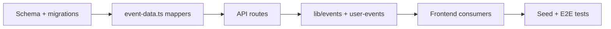

# Event Child Tables Refactor

## Goal

Replace the wide `events` row in [`prisma/schema.prisma`](prisma/schema.prisma) with a slim parent `Event` plus five 1:1 step tables. Keep `categories` and `waves` as JSON inside their step tables (per your choice). Change the API to a **hybrid shape**: flat scalars on the event root, nested objects for 1:1 step data, arrays for 1:many relations.

## Target Schema

```mermaid
erDiagram
  Event ||--o| EventBasics : has
  Event ||--o| EventSchedule : has
  Event ||--o| EventFormat : has
  Event ||--o| EventTickets : has
  Event ||--o| EventDetails : has
  Event ||--o{ Registration : has
  Event ||--o{ Announcement : has
  Event ||--o{ Review : has
  Event }o--|| Organiser : belongs_to
  Event }o--o| Admin : reviewed_by

  Event {
    uuid id PK
    uuid organiserId FK
    enum status
    bool isPinned
    string adminNotes
    string rejectionReason
    uuid reviewedById FK
    datetime reviewedAt
    datetime createdAt
    datetime updatedAt
  }

  EventBasics {
    uuid eventId PK_FK
    string title
    string tagline
    string description
  }

  EventSchedule {
    uuid eventId PK_FK
    string eventDate
    string endDate
    string startTime
    string endTime
    string venue
    string address
    string city
    string state
  }

  EventFormat {
    uuid eventId PK_FK
    string discipline
    string format
    string level
    json categories
    int cap
    int minAge
  }

  EventTickets {
    uuid eventId PK_FK
    json waves
    string inclusions
    string extras
    string activations
    string refundPolicy
    string registrationType
    string feeStructure
    string registrationUrl
  }

  EventDetails {
    uuid eventId PK_FK
    string coverImageUrl
    string bagDrop
    string parking
    string accessibilityInfo
    string additionalNotes
  }
```

### Parent `Event` — scalars + workflow only

| Field | Notes |
|---|---|
| `id`, `organiserId`, `status`, `isPinned` | Identity and lifecycle |
| `adminNotes`, `rejectionReason`, `reviewedById`, `reviewedAt` | Admin review workflow (not a wizard step) |
| `createdAt`, `updatedAt` | Timestamps |

Everything currently grouped under wizard steps moves to child tables. `registrationUrl` moves to `EventTickets` (collected on the Tickets step in the wizard).

### Step mapping (matches [`app/organiser/new-listing/page.tsx`](app/organiser/new-listing/page.tsx))

| Wizard step | Child model | Fields |
|---|---|---|
| 0 — The Basics | `EventBasics` | `title`, `description`, `tagline` |
| 1 — Date & Location | `EventSchedule` | `eventDate`, `endDate`, `startTime`, `endTime`, `venue`, `address`, `city`, `state` |
| 2 — Format & Categories | `EventFormat` | `discipline`, `format`, `level`, `categories` (JSON), `cap`, `minAge` |
| 3 — Tickets & Pricing | `EventTickets` | `waves` (JSON), `inclusions`, `extras`, `activations`, `refundPolicy`, `registrationType`, `feeStructure`, `registrationUrl` |
| 4 — Details & Media | `EventDetails` | `coverImageUrl`, `bagDrop`, `parking`, `accessibilityInfo`, `additionalNotes` |
| 5 — Review & Publish | *(no table)* | Confirmation only |

Use `@relation` with `eventId` as `@id` on each child (true 1:1). Child rows are **optional** for drafts — only `EventBasics` is required to save a draft (title).

---

## Target API Shape

### Read response (full event)

```typescript
interface EventResponse {
  // Flat scalars on the event root
  id: string
  organiserId: string
  status: EventStatus
  isPinned: boolean
  adminNotes: string | null
  rejectionReason: string | null
  reviewedAt: string | null
  createdAt: string
  updatedAt: string

  // 1:1 wizard step data — named sub-objects
  basics: {
    title: string
    tagline: string | null
    description: string | null
  } | null
  schedule: {
    eventDate: string
    endDate: string | null
    startTime: string
    endTime: string | null
    venue: string
    address: string | null
    city: string
    state: string
  } | null
  format: {
    discipline: string
    format: string
    level: string
    categories: unknown
    cap: number | null
    minAge: number
  } | null
  tickets: {
    waves: unknown
    inclusions: string | null
    extras: string | null
    activations: string | null
    refundPolicy: string | null
    registrationType: string
    feeStructure: string
    registrationUrl: string | null
  } | null
  details: {
    coverImageUrl: string | null
    bagDrop: string | null
    parking: string | null
    accessibilityInfo: string | null
    additionalNotes: string | null
  } | null

  // 1:many / lookup relations — only when explicitly included
  organiser?: OrganiserSummary
  reviewedBy?: AdminSummary | null
  registrations?: Registration[]
  announcements?: Announcement[]
  reviews?: Review[]
  registrationCount?: number  // computed, list endpoints only
}
```

### Write request (POST/PATCH)

Same nested shape for step objects. Root scalars the client may send: none beyond what the server sets (`status` derived from `submit` flag). Validation rules stay the same but read from nested paths:

- Draft: `basics.title` required
- Publish: `basics.title`, `format.discipline`, `schedule.eventDate`, `schedule.startTime`, `schedule.venue`, `schedule.city`, `schedule.state`, `format.format`, `format.level`
- External registration: `tickets.registrationType === "external"` requires `tickets.registrationUrl`

### List vs detail includes

| Endpoint | Includes |
|---|---|
| `GET /api/organiser/events` | `basics`, `schedule`, `format`, `tickets`, `details`, `_count.registrations` |
| `GET /api/organiser/events/[id]` | All five step objects (full wizard resume) |
| `GET /api/admin/events` | Step objects + `organiser` |
| Public listing (`lib/events.ts`) | Step objects needed for cards/detail + `organiser` |
| Checkout/webhook | `tickets`, `format`, `organiser` only |

---

## Central Mapper Layer

Add [`lib/event-data.ts`](lib/event-data.ts) as the single source of truth for Prisma ↔ API conversion:

- **`toEventResponse(prismaEvent)`** — maps Prisma `include` result to nested API shape
- **`buildEventUpsert(data, submit)`** — maps nested write payload to Prisma nested `create`/`upsert` for all five child tables inside a transaction
- **`eventInclude.full` / `eventInclude.listing` / `eventInclude.checkout`** — reusable Prisma `include`/`select` presets
- **`getRequiredFields(submit)`** — nested-path validation helper

This avoids duplicating field mapping across ~10 API routes and [`lib/events.ts`](lib/events.ts).

Update [`lib/user-events.ts`](lib/user-events.ts) `toUserEvent()` to read from nested shape (`event.basics.title`, `event.schedule.eventDate`, `event.tickets.waves`, etc.) instead of flat fields.

---

## Migration Strategy

1. Add five new child tables **without dropping** old `events` columns yet
2. Backfill child rows from existing `events` data in a SQL migration step
3. Update application code to read/write child tables only
4. Drop migrated columns from `events` in a follow-up migration step (same PR, two migration files)

Backfill example (one row per existing event):

```sql
INSERT INTO event_basics (event_id, title, tagline, description)
SELECT id, title, tagline, description FROM events;
-- repeat for schedule, format, tickets, details
```

[`prisma/seed.ts`](prisma/seed.ts) updated to use nested `create` with child relations.

---

## Files to Change

### Schema & data
- [`prisma/schema.prisma`](prisma/schema.prisma) — new models, slim `Event`
- `prisma/migrations/` — create + backfill + drop-column migrations
- [`prisma/seed.ts`](prisma/seed.ts)

### New shared layer
- **`lib/event-data.ts`** — mappers, includes, validation
- [`lib/events.ts`](lib/events.ts) — use nested includes + mapper
- [`lib/user-events.ts`](lib/user-events.ts) — consume nested shape

### API routes (swap flat field access for mapper)
- [`app/api/organiser/events/route.ts`](app/api/organiser/events/route.ts)
- [`app/api/organiser/events/[id]/route.ts`](app/api/organiser/events/[id]/route.ts)
- [`app/api/organiser/events/[id]/dashboard/route.ts`](app/api/organiser/events/[id]/dashboard/route.ts)
- [`app/api/checkout/route.ts`](app/api/checkout/route.ts)
- [`app/api/stripe/webhook/route.ts`](app/api/stripe/webhook/route.ts)
- [`app/api/admin/events/route.ts`](app/api/admin/events/route.ts)
- [`app/api/admin/events/[id]/review/route.ts`](app/api/admin/events/[id]/review/route.ts)

### Frontend (nested API consumers)
- [`app/organiser/new-listing/page.tsx`](app/organiser/new-listing/page.tsx) — transform `FormState` ↔ nested payload in `submitToApi` and draft loader
- [`app/organiser/listings/page.tsx`](app/organiser/listings/page.tsx), [`app/organiser/dashboard/page.tsx`](app/organiser/dashboard/page.tsx) — read `event.basics.title`, `event.schedule.city`, etc.
- [`app/organiser/events/[id]/dashboard/page.tsx`](app/organiser/events/[id]/dashboard/page.tsx)
- [`app/admin/events/page.tsx`](app/admin/events/page.tsx)
- Public pages/components using event fields: [`components/EventCard.tsx`](components/EventCard.tsx), [`components/EventsListing.tsx`](components/EventsListing.tsx), [`app/(user)/events/[id]/register/page.tsx`](app/(user)/events/[id]/register/page.tsx), etc.

### Tests
- Update [`e2e/api.spec.ts`](e2e/api.spec.ts) and [`e2e/organiser.spec.ts`](e2e/organiser.spec.ts) for nested request/response assertions
- Add unit tests in `src/__tests__/event-data.test.ts` for mapper round-trip

---

## Implementation Order



---

## Out of Scope (for now)

- Per-step PATCH endpoints (still save full nested payload on draft/publish)
- Normalizing `categories` / `waves` into row tables (`EventCategory`, `EventWave`)
- Wiring the placeholder UI fields in ExtrasStep (`bagDrop`, `parking`, `additionalNotes`) — schema columns exist in `EventDetails` but wizard wiring is a separate small follow-up
